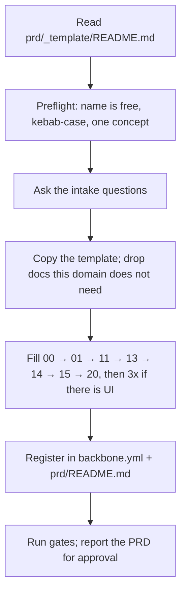

# /add-prd `<domain>` `<description>`

Creates `prd/<domain>/` from `prd/_template/` and fills it in. `<description>` is a one-line
statement of what the feature is — the starting point for the intake, not a substitute for it.

**Scope wall: the PRD is the deliverable.** Write no schema, no endpoints, no UI as part of this
command — implementation is a separate request, made after the PRD is approved. Writing code here
would bake in exactly the assumptions the intake exists to surface.

## Step 1 — Preflight

- `prd/<domain>/` must not already exist — if it does, stop and ask whether to amend it instead;
  overwriting a PRD destroys the decision log that made it worth keeping.
- Name is kebab-case and names one concept, in the noun a user would say.
- Read `prd/_template/README.md` — it is the authority on which docs are required, which are
  optional, and what belongs in each.

## Step 2 — Intake (ask before writing)

Run the intake questions from `prd/_template/README.md`: the wall (hard non-goals), read-only vs
CRUD, entities and which already exist as reference tables, personas and auth, UI scope, money,
time semantics, and the golden scenarios.

Ask them as a batched set, not one at a time. Two rules on the answers:

- Never invent one — an unanswered question goes into `CONTEXT.md`'s *Open questions* naming the
  step it blocks, because a guessed answer reads as a decision and stops being questioned.
- If the user cannot name any golden scenario, say so plainly: the feature is not specified yet,
  and that is the thing to resolve before there is a PRD worth writing.

## Step 3 — Build the folder

1. Copy `prd/_template/` to `prd/<domain>/`.
2. Delete the copied `README.md` — it is the template's own guide, not domain content.
3. Delete the optional docs this domain does not need (`01`, `13`, `14`, `15`, `3x`) per the
   template README's table. An empty doc is worse than a missing one — it reads as a spec that
   nobody wrote rather than a decision that it was not needed.
4. Fill the rest in order: `00` → `01` → `11` → `13` → `14` → `15` → `20`, then the `3x`
   frontend docs if the domain has UI.
5. Strip every `> TEMPLATE:` line and every `{{placeholder}}` as you go. A shipped PRD contains
   zero template scaffolding — leftover scaffolding makes a later session treat live spec as
   boilerplate and skip it.
6. Seed `CONTEXT.md`: today's date, the current step, the confirmed decisions from the intake
   (quoting the user where a decision came from them), open questions, and the unticked
   progress checklist.

## Step 4 — Register and verify

- `backbone.yml` — add the domain under `prd.domains` with a one-line comment on its scope.
- `prd/README.md` — add its row to the Domains table, Status "PRD written, not implemented".
- Run `pnpm check:backbone && pnpm check:instructions`.

## Step 5 — Report for approval

Summarize: the wall (the non-goals, since that is what the user most needs to confirm), the
entities, the golden scenarios, which optional docs were dropped and why, and every open
question. Then stop — implementation begins only when the user approves the PRD.
