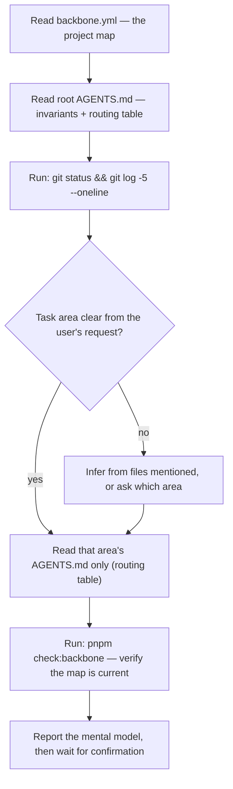

# /bootstrap — session initialization

Orientation only: do not modify any file during bootstrap. Non-Claude agents follow the same flow manually.

## Report format

Keep it under 12 lines:

1. **Stack** — one line (from backbone.yml, not from exploring).
2. **Task area** — which scoped AGENTS.md was loaded and why.
3. **Repo state** — branch, dirty files, last commit; flag uncommitted `openapi.json`/`generated/` drift.
4. **Constraints in effect** — the 2–4 boundaries most relevant to this task.
5. **Plan** — numbered steps, referencing the area's Mermaid workflow.

## Rules

- Never explore with `find`/`grep`/`ls` during bootstrap — backbone.yml already maps the topology; exploration burns the context this command exists to save.
- Never skip the report — the user corrects a wrong mental model in seconds; a wrong implementation costs the session.
