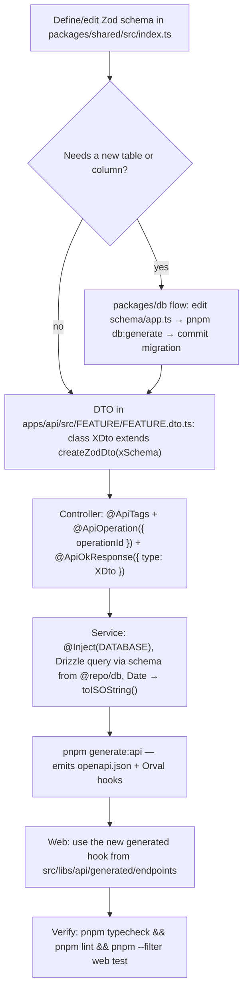

# Add or change an API endpoint

The contract pipeline is one loop — never implement only one end of it.



## Hard rules

- `operationId` names the generated hook (`listPosts` → `useListPosts`) — omit it and Orval invents an unstable name.
- IDs: never set `id` on inserts — ULIDs come from the schema `$defaultFn`; contracts validate them with `ulidSchema`.
- Dates: `z.iso.datetime()` in contracts, `.toISOString()` in services — `Date` breaks OpenAPI generation.
- Copy `apps/api/src/posts/` for the file shape; register the module in `app.module.ts`.
- Commit code + `openapi.json` + regenerated hooks together — CI fails on contract drift.

## Verification

```bash
pnpm generate:api
pnpm typecheck && pnpm lint
git status   # spec + generated hooks must be staged with the change
```
