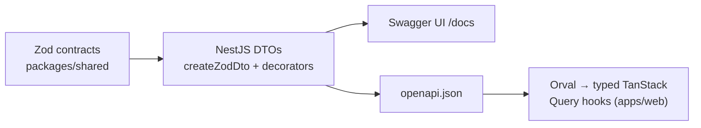

# SaaS Starter — Turborepo · Next.js · NestJS (Fastify) · Drizzle · Better Auth

A production-ready SaaS monorepo (pnpm workspaces + Turborepo):

- **apps/web** — [Next-Elite](https://github.com/salmanshahriar/Next-Elite) (Next.js 16 + React 19, shadcn/ui, Tailwind v4, next-intl i18n, RBAC, TanStack Query) adapted to consume the NestJS backend, with **Orval-generated typed API hooks**.
- **apps/api** — NestJS 11 on the **Fastify** adapter. Owns **Better Auth** (`/api/auth/*`), talks to Postgres via **Drizzle ORM**, documents itself with **Swagger/OpenAPI**, logs with **pino**, and returns a consistent structured error envelope.
- **packages/db** — Drizzle schema (Better Auth tables + app tables), db client factory, drizzle-kit migrations.
- **packages/auth** — Shared Better Auth config (`createAuth`) with the Drizzle adapter + admin plugin.
- **packages/shared** — Zod contracts: the single source of truth for request/response shapes.

**Tooling:** pnpm · Turborepo · Biome (lint + format) · Vitest · Playwright.



## Quick start

Prerequisites: Node.js ≥ 22.12, pnpm ≥ 10 (`corepack enable`), Docker.

```bash
pnpm install
cp .env.example .env            # set BETTER_AUTH_SECRET (openssl rand -base64 32)
docker compose up -d            # Postgres 17 on :5432
pnpm db:push                    # apply the Drizzle schema (dev)
pnpm dev                        # web :3000, api :3001, Swagger at :3001/docs
```

Demo mode is on by default: the login page shows click-to-fill accounts
(`admin@test.com` / `user@test.com`, password `12345678`). `admin@test.com`
is in `AUTH_ADMIN_EMAILS`, so it lands in the DB with `role = 'admin'`.

## Architecture

### Auth (Better Auth on NestJS/Fastify)

- `AuthModule.forRoot({ auth })` (from `@thallesp/nestjs-better-auth`) mounts
  Better Auth at `/api/auth/*` and registers a **global AuthGuard** — every
  route requires a session unless decorated `@AllowAnonymous()` /
  `@OptionalAuth()`. Auth-route CORS comes from `trustedOrigins`
  (Fastify serves these routes through middleware, so app-level CORS doesn't
  cover them — the module handles it).
- The web's `authClient` points at `NEXT_PUBLIC_API_URL`; Server Components
  validate sessions by forwarding cookies to `GET /api/auth/get-session`
  (`apps/web/src/features/auth/server/get-current-user.ts`). The web app
  never touches the database.
- Roles live in the DB (`user.role`, Better Auth admin plugin); emails in
  `AUTH_ADMIN_EMAILS` are promoted at sign-up via a database hook in
  `packages/auth`.

### API contract pipeline (Zod → Swagger → Orval)

1. Define request/response schemas once in `packages/shared` (wire format —
   dates are ISO strings).
2. Derive NestJS DTOs with `createZodDto` (`apps/api/src/posts/posts.dto.ts`).
   The global `ZodValidationPipe` validates every `@Body/@Query/@Param`;
   `@nestjs/swagger` decorators (`@ApiOkResponse({ type: PostDto })`,
   `@ApiOperation({ operationId })`) document them. `cleanupOpenApiDoc`
   (nestjs-zod) turns the Zod DTOs into clean OpenAPI schemas.
3. `pnpm generate:api` builds the spec (`apps/api/openapi.json`, no server or
   DB needed) and runs Orval, emitting typed TanStack Query hooks into
   `apps/web/src/libs/api/generated` (committed — do not edit by hand).

Using a generated hook:

```tsx
'use client';
import { useListPosts, useCreatePost } from '@/libs/api/generated/endpoints';

const { data: posts } = useListPosts();          // typed PostDto[]
const createPost = useCreatePost();
createPost.mutate({ data: { title: 'Hello' } }); // typed + validated server-side
```

All hooks go through `src/libs/api/mutator.ts`: it prefixes
`NEXT_PUBLIC_API_URL`, always sends the session cookie, and throws a typed
`ApiError` carrying the API's structured error body.

### Logging (pino) & error handling

- **nestjs-pino** wraps every request in structured logs. Dev: pretty,
  single-line. Prod (`NODE_ENV=production`): JSON lines. Level via `LOG_LEVEL`.
- **Request correlation**: Fastify's `genReqId` (in `main.ts`) creates a UUID
  per request — or reuses an incoming `x-request-id` — and it's echoed as a
  response header, attached to every log line, and included in error bodies.
- **Redaction**: `cookie`, `set-cookie`, `authorization`, and password/token
  fields never reach the logs.
- **AllExceptionsFilter** returns one consistent envelope for every failure:

```json
{
  "statusCode": 400,
  "error": "BAD_REQUEST",
  "message": "Validation failed",
  "requestId": "d106f222-…",
  "path": "/api/posts",
  "timestamp": "2026-07-11T17:20:49.484Z",
  "issues": [{ "path": ["title"], "code": "too_small", "message": "…" }]
}
```

  4xx are logged as `warn`; 5xx as `error` with the stack. Unknown exceptions
  never leak internals — clients get a generic 500, details go to the logs
  (find them by `requestId`). A response failing its own Zod contract
  (`ZodSerializationException`) is treated as a 500: the API broke its
  contract, and the mismatch is logged.

### Lint & format (Biome)

One `biome.json` at the root replaces ESLint + Prettier everywhere
(`pnpm lint`, `pnpm lint:fix`, `pnpm format`). Notes:

- `unsafeParameterDecoratorsEnabled` is on for NestJS parameter decorators,
  and `useImportType` is off for `apps/api` (Nest DI needs runtime imports).
- CSS is excluded (Biome doesn't parse Tailwind v4 at-rules); Tailwind owns it.
- Some a11y rules are downgraded to warnings for `apps/web` — pre-existing
  patterns in the upstream starter. Tighten them as you touch those files.
- Orval output, drizzle migrations, and `openapi.json` are ignored.

## IDs: ULIDs everywhere

Every generated identifier is a ULID (26-char, Crockford base32, lexicographically
sortable by creation time): Drizzle PKs via `$defaultFn(() => createId())` and all
Better Auth records via `advanced.database.generateId`. Both use the single
monotonic generator `createId()` in `packages/db/src/id.ts` (ulidx). The shared
contracts validate ID fields with `ulidSchema`.

## Database workflow

Schema lives in `packages/db/src/schema/` (`auth.ts` = Better Auth tables,
`app.ts` = your tables).

```bash
pnpm db:generate   # emit SQL migration from schema changes
pnpm db:migrate    # apply migrations
pnpm db:push       # dev-only: push schema directly
pnpm db:studio     # Drizzle Studio UI
```

If you change Better Auth plugins in `packages/auth`, regenerate its tables
with `npx @better-auth/cli@latest generate` and reconcile with
`packages/db/src/schema/auth.ts`.

## Adding an endpoint (the full loop)

1. Add the Zod schemas to `packages/shared`.
2. Create the DTOs (`createZodDto`) + controller with Swagger decorators
   (always set an `operationId` — it becomes the hook name).
3. `pnpm generate:api` → typed hooks appear in the web app.
4. Use the hook. Done — validation, docs, and types all come from step 1.

## Production deployment

Deploy web and api separately on sibling subdomains
(`yourapp.com` + `api.yourapp.com`) and set:

```bash
NODE_ENV=production
BETTER_AUTH_URL=https://api.yourapp.com
WEB_URL=https://yourapp.com
NEXT_PUBLIC_API_URL=https://api.yourapp.com
COOKIE_DOMAIN=.yourapp.com     # cross-subdomain session cookie
BETTER_AUTH_SECRET=<strong secret>
NEXT_PUBLIC_DEMO_MODE=false
LOG_LEVEL=info
```

Google OAuth redirect URI: `{BETTER_AUTH_URL}/api/auth/callback/google`.
Consider disabling Swagger UI in production (guard `setupSwagger` behind an
env flag) if your API isn't public.

## Scripts

| Command | Description |
| --- | --- |
| `pnpm dev` | web + api in watch mode (packages build first) |
| `pnpm dev:web` / `dev:api` | one app |
| `pnpm build` | build everything (turbo-cached) |
| `pnpm generate:api` | OpenAPI spec → Orval hooks |
| `pnpm lint` / `lint:fix` / `format` | Biome across the repo |
| `pnpm typecheck` / `test` | quality gates |
| `pnpm db:*` | Drizzle workflows |
| `pnpm check:backbone` | verify backbone.yml paths resolve (pre-commit + CI) |
| `pnpm check:instructions` | lint agent instruction files (pre-commit + CI) |
| `pnpm check:dupes` | DRY gate — fail above 2% duplicated lines (pre-commit + CI) |

## Agentic development (CLAUDE.md / AGENTS.md)

The repo ships scoped agent instruction files for Claude Code, Codex, Cursor,
and friends, designed for **minimal context loading**: the root file is always
in context, while area files load only when the agent works in that subtree.

```
AGENTS.md                     root: repo map, commands, invariants, routing table
apps/web/AGENTS.md            frontend-only context (loads only for UI work)
apps/api/AGENTS.md            backend-only context (loads only for API work)
packages/db|shared|auth/...   schema / contracts / auth config context
CLAUDE.md (every level)       one-line @AGENTS.md import — Claude Code auto-loads
                              nested CLAUDE.md files lazily per directory
AGENT.md                      root stub for Amp-style tools
backbone.yml                  machine-readable project map (structure, conventions,
                              boundaries, generated artifacts, relationships)
```

`backbone.yml` implements the [backbone.yml pattern](https://dev.to/cleverhoods/claudemd-best-practices-the-backboneyml-pattern-30fi):
instead of exploring with `find`/`grep`/`ls` (the "exploration tax" — tokens
and time spent orienting instead of working), agents read the map on demand.
The root `AGENTS.md` Initialization section makes this explicit: consult
`backbone.yml` before any exploratory command; use search only for what a map
can't answer (symbol usages, code content). The map also encodes what
directories can't express: generated artifacts and their regenerate commands,
never-modify boundaries, and relationship chains (contract pipeline, auth
chain). Accuracy is **enforced, not just documented**: `pnpm check:backbone`
(scripts/check-backbone.mjs) verifies every path the map references exists on
disk, and runs in both the lefthook pre-commit hook and CI. CI additionally
fails if `openapi.json` or the Orval-generated hooks are stale relative to the
code (`pnpm generate:api` + clean-diff check) — the instruction files describe
the rules, the hooks and CI verify the output meets them.

The root file also tells agents what NOT to read — e.g. for frontend work,
learn API shapes from `apps/api/openapi.json` or the generated hooks instead
of NestJS source. Canonical content lives only in `AGENTS.md` files; edit
those, never the stubs.

The full agentic stack, following the reporails series (parts 1–6):

- **Mermaid workflows** — every multi-step process (add an endpoint, change a
  contract, change the schema, bootstrap a session) is a flowchart with
  decision branches, not prose: agents follow flowcharts more reliably
  (FlowBench, EMNLP 2024), they cost 3–6x fewer tokens, and they can't rot
  invisibly.
- **`/bootstrap`** (`.claude/commands/bootstrap.md`) — first command of every
  session: read backbone.yml, check `git status`, load only the task-relevant
  scoped file, report a mental model before touching anything. Works manually
  for non-Claude agents.
- **`add-endpoint` skill** (`.claude/skills/add-endpoint/`) — the whole
  contract loop packaged as an executable procedure with verification steps.
- **Hard-constraint hooks** (`.claude/settings.json` +
  `scripts/hooks/block-generated.mjs`) — a PreToolUse hook that *blocks*
  writes to generated files (Orval output, `openapi.json`, migrations,
  lockfile) at the tool layer. Instruction files are soft context; the hook
  fires even when the context window is full.
- **Coding-practice enforcement** — split by what each layer does best:
  judgment rules with rationale live in the root `AGENTS.md` "Coding
  principles" section (rule-of-three DRY, no hasty abstractions, YAGNI,
  reuse-before-writing); the mechanical part is enforced — `jscpd` fails
  pre-commit/CI above 2% duplicated lines (baseline ~1%, generated and
  vendored code excluded via `.jscpd.json`), Biome warns on cognitive
  complexity >15, and a PostToolUse hook auto-formats every file the agent
  edits so style never consumes context.
- **Instruction linting** (`pnpm check:instructions`) — deterministic
  formatting rules enforced in pre-commit + CI: heading depth ≤ 3, line
  budgets per file, every prohibition carries an em-dash rationale, Mermaid
  blocks parse. Same loop as `check:backbone`: the files describe the rules,
  the checks verify them.

## Notes on the Next-Elite adaptation

Auth server moved to NestJS (route handler + server auth instance removed);
`authClient`, `apiFetch` and `getCurrentUser` target the API; role resolution
prefers the DB `user.role`. ESLint/Prettier replaced by Biome (config removed,
lefthook updated). The upstream `.github` CI was replaced by a root workflow
(`.github/workflows/ci.yml`) covering backbone, lint, build, typecheck, tests,
and contract drift. Git hooks moved to the root `lefthook.yml` (installed by
the root `prepare` script); commitlint config now lives in the root package.json. Everything else —
i18n, SEO, RBAC parallel routes, demo mode, Vitest/Playwright — is untouched.
