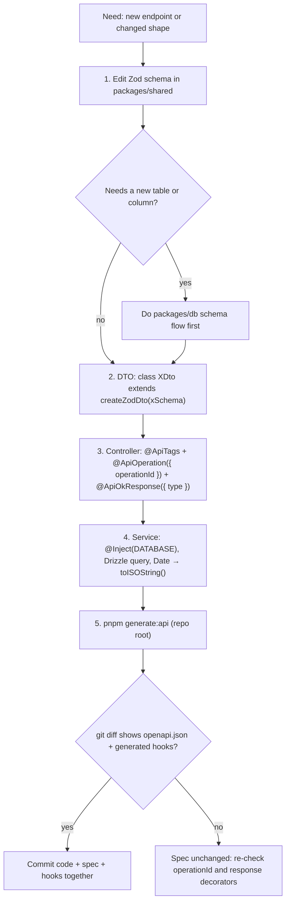

# apps/api — Backend context

> Repo-wide paths and boundaries: root `backbone.yml` — read it before exploring with `find`/`grep`/`ls`.

NestJS 11 on the Fastify adapter. Better Auth owns `/api/auth/*`. Drizzle ORM (Postgres), nestjs-zod DTOs, Swagger at `/docs`, pino logging, one global exception filter. Routes are prefixed `/api` (`main.ts`); `/health` is unprefixed and anonymous.

## Structure

- `src/main.ts` — Fastify adapter, `genReqId` (x-request-id), CORS, Swagger, `/api` prefix
- `src/app.module.ts` — LoggerModule, `AuthModule.forRoot`, global pipe + filter
- `src/env.ts` — typed env (app `.env`, then repo-root `.env`); add new vars here
- `src/auth/auth.ts` — Better Auth singleton (config from `@repo/auth`)
- `src/database/database.module.ts` — `DATABASE` injection token → Drizzle client
- `src/common/filters/` + `src/common/logger/` — error envelope, pino config
- `src/posts/` — reference feature; copy its controller/service/dto/module shape

## Workflow: add or change an endpoint

`operationId` is mandatory — it becomes the generated frontend hook's name; without it Orval invents one and renames break the web app. The global `ZodValidationPipe` validates every `@Body/@Query/@Param` DTO automatically — do not call `schema.parse` manually.

- Declare literal routes above parametric ones in the same controller (`@Get('search')` before `@Get(':id')`) — Nest matches in declaration order, so a leading `:id` swallows the literal path and answers it with a lookup failure for an id that was never one.
- Mark POST endpoints that compute rather than create with `@HttpCode(200)` — Nest defaults POST to 201, which tells the client a resource was created when validation/resolution endpoints create nothing.

## Auth

- Global AuthGuard (from `@thallesp/nestjs-better-auth`): every route requires a session; opt out per route with `@AllowAnonymous()` or `@OptionalAuth()`.
- Read the user with `@Session() session: UserSession` → `session.user.id`, `session.user.role`.
- Fastify caveat: auth-route CORS comes from `trustedOrigins` in `packages/auth`; `app.enableCors` covers only REST routes.

## Errors

- Throw Nest `HttpException` subclasses (`NotFoundException`, `ForbiddenException`, ...) — `AllExceptionsFilter` formats the single envelope `{ statusCode, error, message, requestId, path, timestamp, issues? }` and logs it.
- Never try/catch just to log and rethrow — the filter already logs every failure once; double-logging buries the real signal.
- Never invent per-route error shapes — clients parse one envelope; a second shape breaks the web `ApiError` handling.
- Let unknown errors propagate — clients get a generic 500; details land in the logs keyed by `requestId`.

## Logging

- Never use `console.log` — it bypasses redaction and structure; inject `PinoLogger`, call `logger.setContext(MyService.name)`, then `this.logger.info({ orderId }, 'order created')`.
- Request/response logging is automatic with `x-request-id` correlation; cookies, authorization headers, and password/token fields are redacted (`common/logger/logger.config.ts`).

## Boundaries

- Never import from `apps/web` — the only contract with the frontend is `packages/shared` + the OpenAPI spec; direct imports create a circular build.
- Never add routes under `/api/auth/*` — Better Auth owns the path; collisions shadow auth endpoints.
- Never build custom JWT or session middleware — Better Auth is the session authority; a second mechanism forks identity.
- Never set `id` on inserts — ULIDs come from the schema's `$defaultFn` (`createId` in `@repo/db`); manual ids break time-ordering.
- Never convert Nest injectables to `import type` — DI needs runtime imports; type-only imports erase decorator metadata (Biome's `useImportType` is off here for this reason).
- Schema and table changes belong in `packages/db`, not inline here — see its AGENTS.md.
