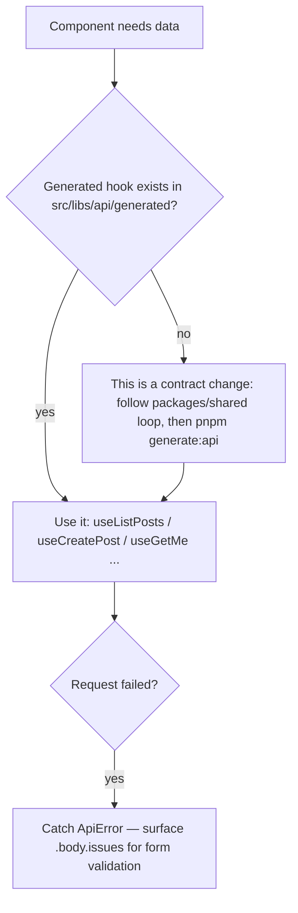

# apps/web — Frontend context

> Repo-wide paths and boundaries: root `backbone.yml` — read it before exploring with `find`/`grep`/`ls`.

Next.js 16 (App Router, Turbopack), React 19, Tailwind v4, shadcn/ui, TanStack Query v5, next-intl, Better Auth client, Vitest + RTL, Playwright. This app is a pure frontend — all data comes from the NestJS API at `NEXT_PUBLIC_API_URL`.

## Structure

- `src/app/` — App Router; `(site)/` public, `(auth)/` login, `dashboard/@admin|@user` parallel routes for RBAC
- `src/features/<x>/` — feature modules (auth, i18n, navigation, site, theme, users): components/hooks/lib/server per feature
- `src/components/ui/` — vendored shadcn primitives
- `src/libs/` — `env.ts` (typed env), `api/` (Orval mutator + generated), `utils.ts`
- `messages/` — next-intl translations (en, es, fr, ar, bn, zh)

## Data fetching

The mutator (`src/libs/api/mutator.ts`) already sends the session cookie and normalizes errors — every generated hook goes through it.

- Never hand-write `fetch` calls to the API — they bypass the typed contract, the cookie handling, and the `ApiError` envelope.
- Never edit `src/libs/api/generated/` — Orval output; regenerate with `pnpm generate:api`.
- To learn an endpoint, read `apps/api/openapi.json` or the generated models — not NestJS source (wastes context; the spec is the contract).

## Auth

- Client components: `authClient` from `@/features/auth/lib/auth-client` — `signIn`, `signUp`, `signOut`, `useSession`.
- Server components/actions: `getCurrentUser()` from `@/features/auth/server/get-current-user` — validates the cookie against the API.
- RBAC: `user.role` comes from the DB via the session; gate UI with `requireUser`/`requirePermission` and the `@admin`/`@user` parallel routes.
- Never decode cookies or query the database here — the API is the only session authority; a local shortcut desyncs from bans/expiry.

## Conventions

- UI patterns: before hand-building a dropdown, picker, overlay, or any other interactive pattern, check whether shadcn/ui has an official component for it and vendor that (`npx shadcn@latest add <name>` from `apps/web` — respects `components.json`) instead of improvising from lower-level Radix primitives. A hand-rolled `combobox.tsx` (Popover + plain `<button>`s instead of the real Popover+Command pattern) shipped a real bug: nested inside a `Dialog`, every option was visible but unclickable, because Radix Dialog sets `pointer-events: none` on `<body>` while open and only the real shadcn components are written to correctly reset that on themselves. Rebuilding it on shadcn's actual `Command` component fixed it outright.
- Env vars: add to `src/libs/env.ts` (schema + `experimental__runtimeEnv`) AND `.env.example` — never read `process.env` directly; unvalidated env fails at runtime instead of boot.
- Styling: Tailwind v4 utilities + semantic tokens (`bg-background`, `text-muted-foreground`) with the `cn()` helper — raw colors break dark mode.
- Every user-facing string goes through `useTranslations` (`messages/`) — hardcoded copy breaks the other five locales.
- State: TanStack Query for server state, React state/context for UI state. Never add Redux or Zustand — a second store duplicates the query cache and splits invalidation.
- Add `'use client'` only where interactivity requires it — Server Components are the default and keep the bundle small.

## Testing

- Unit/component: colocated `*.test.ts(x)` — `pnpm --filter web test` (Vitest + RTL, jsdom)
- e2e: `e2e/*.spec.ts` — `pnpm --filter web test:e2e` (needs the API running for auth flows)
- Update a feature's tests in the same change — stale tests hide regressions from CI.

## Boundaries

- Never add database access or data API routes — the NestJS API is the single data owner; a parallel path forks validation and auth.
- Never reformat `src/components/ui/` wholesale — vendored shadcn; churn there makes upstream diffs unreadable. Edit only for real design changes.
