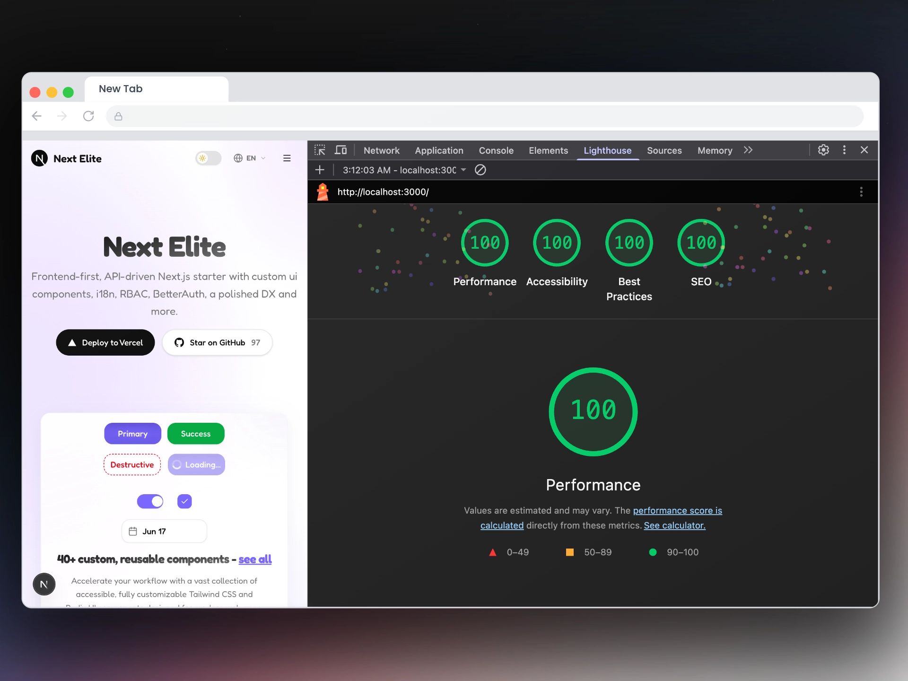
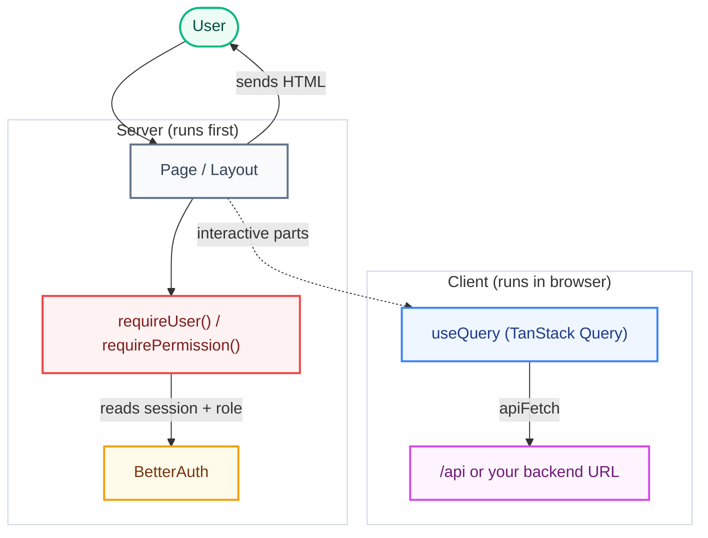

<a href="https://next-elite-boilerplate.vercel.app/">
  
  <h1 align="center">Next Elite</h1>
</a>

<p align="center">
  A production-ready, frontend-first Next.js boilerplate with i18n, RBAC, BetterAuth, and a polished DX out of the box.
</p>

<p align="center">
  <a href="https://github.com/salmanshahriar/Next-Elite">
    
  </a>
  <a href="https://github.com/salmanshahriar/Next-Elite/blob/main/LICENSE">
    
  </a>
</p>

<p align="center">
  <a href="https://next-elite-boilerplate.vercel.app/"><strong>Live Demo</strong></a> ·
  <a href="https://github.com/salmanshahriar/Next-Elite/generate"><strong>Use this Template</strong></a> ·
  <a href="https://github.com/salmanshahriar/Next-Elite/issues"><strong>Report Bug</strong></a> ·
  <a href="https://github.com/salmanshahriar/Next-Elite/issues"><strong>Request Feature</strong></a>
</p>

<p align="center">
  <a href="#introduction"><strong>Introduction</strong></a> ·
  <a href="#one-click-deploy"><strong>One-click Deploy</strong></a> ·
  <a href="#tech-stack--features"><strong>Tech Stack + Features</strong></a> ·
  <a href="#quick-start"><strong>Quick Start</strong></a> ·
  <a href="#architecture-overview"><strong>Architecture Overview</strong></a> ·
  <a href="#configuration"><strong>Configuration</strong></a>
</p>
<br/>

## Introduction

Next Elite is a frontend-first Next.js boilerplate designed to consume APIs (REST/GraphQL/BFF) instead of owning a database, allowing you to drop it on top of any backend you already have.

It is feature-based, offering a polished developer experience (DX), built-in role-based access control (RBAC), type-safe internationalization (i18n), and is optimized for speed, SEO, and developer productivity.

Includes **40+ custom & reusable ui components** built on shadcn/ui.

<br/>

<div align="center">
  
</div>

<br/>

## One-click Deploy

You can deploy this template to Vercel with the button below:

[](https://vercel.com/new/clone?repository-url=https://github.com/salmanshahriar/Next-Elite)

Set the environment variables from `.env.example` in your Vercel project (Production + Preview).

<br/>

## Tech Stack + Features

### Frameworks & Core

- **Next.js 16 (App Router)** - Fast, modern React framework with full support for React 19 features (Server/Client components, Server Actions).
- **TypeScript 6** - End-to-end type safety for rock-solid refactoring and developer experience.
- **Node.js 22** - Built on the latest LTS runtime.
- **Feature-Based Architecture** - Structured around self-contained vertical slices/feature folders under `src/features/` for maximum modularity and clean separation of concerns.

### Authentication & Access Control

- **BetterAuth** - Out-of-the-box email/password and OAuth (Google) authentication using `/api/auth/*` route handlers. Configure admin emails via `AUTH_ADMIN_EMAILS` or `NEXT_PUBLIC_AUTH_ADMIN_EMAILS`.
- **Role-Based Access Control (RBAC)** - Flexible RBAC (`user` and `admin` roles) with server-side guards (`requireUser`, `requirePermission`) and parallel route slots (`@admin`, `@user`) for role-agnostic routing.

### Internationalization (i18n)

- **next-intl** - Type-safe, cookie-based localizations (no URL prefix) with support for English, বাংলা, العربية (RTL), Français, Español, and 简体中文. Translation keys are type-checked (`t("key")` works; typos fail compile-time).

### UI & Styling

- **shadcn/ui** - Highly customizable UI components built with Tailwind CSS, Radix UI, and CVA.
- **Theme Support** - Easy light/dark mode transitions via theme toggle.

### API & Data Fetching

- **TanStack Query (React Query)** - Powerful client-side state management, caching, and data synchronization.
- **apiFetch Client** - A custom Zod-validated `ofetch` wrapper in `src/libs/api-client.ts` supporting type-safe queries and mutations. Includes a complete `users` example feature.

### Observability & Infrastructure

- **Sentry Integration** - Complete error tracking and performance instrumentation for client and server.
- **Logging** - Clean, fast server-side logging using `pino`.
- **Rate Limiting** - Optional rate-limiting helper using Upstash Redis.
- **Health Probes** - Direct `GET /api/health` endpoint for load balancers.

### Quality Gates & Tooling

- **Testing Suite** - Unit/component testing with Vitest and React Testing Library, and E2E testing with Playwright.
- **Hygiene & Linting** - ESLint 9, Prettier formatting, and Knip for dead code/dependency hygiene.
- **Git Hook Automation** - Lefthook pre-commit hooks and Commitlint to maintain codebase quality.

<br/>

## Lighthouse report

<div align="center">
  
</div>

<br/>

## Quick Start

### Prerequisites

- Node.js **22.12** or later
- **npm**

### Local Setup

1. Clone the repository and navigate into it:
   ```bash
   git clone https://github.com/salmanshahriar/Next-Elite.git
   cd Next-Elite
   ```
2. Install dependencies:
   ```bash
   npm install
   ```
3. Set up your environment variables:
   ```bash
   cp .env.example .env
   ```
4. Start the development server:
   ```bash
   npm run dev
   ```

Open [http://localhost:3000](http://localhost:3000) to view your local instance.

### Demo Credentials

When `NEXT_PUBLIC_DEMO_MODE=true` is enabled, the login screen includes a quick-fill panel with these seed credentials:

| Role  | Email            | Password   |
| ----- | ---------------- | ---------- |
| User  | `user@test.com`  | `12345678` |
| Admin | `admin@test.com` | `12345678` |

> [!NOTE]
> For production deployments, set `NEXT_PUBLIC_DEMO_MODE=false` or remove the self-contained `src/features/auth/demo/` module.

### Docker Setup

Run the application locally via Docker:

```bash
cp .env.example .env
docker build -t next-elite .
docker run --rm --env-file .env -p 3000:3000 next-elite
```

Or using Docker Compose:

```bash
docker compose up --build
```

### Multi-Arch Deploy (ARM64 + AMD64)

The Dockerfile produces images that run on both `linux/amd64` and `linux/arm64`.
Build a multi-arch image with Buildx:

```bash
docker buildx create --name multiarch --use   # one-time setup
docker buildx build --platform linux/amd64,linux/arm64 -t next-elite .
```

This is ideal for self-hosting on ARM servers (Oracle Cloud, Raspberry Pi, etc.).

### Dokploy Deployment

This template is ready for [Dokploy](https://dokploy.com) — the open-source PaaS.

1. Create a new **Application** in Dokploy and point it to your fork of this repo.
2. Set the build type to **Dockerfile** (auto-detected).
3. Configure environment variables via the Dokploy UI (see `.env.example` for the full list).
4. Deploy — Dokploy automatically builds and runs the container with health checks.

The included `HEALTHCHECK` instruction pings `/api/health` so Dokploy
can monitor and restart the container if it becomes unresponsive.

<br/>

## Architecture Overview

The big picture: a page is rendered on the server, auth/role is checked there, and any live data is fetched on the client.



**How a request flows:**

1. **User opens a page** — the Server Component renders first.
2. **Auth + role check** — `requireUser()` / `requirePermission()` read the BetterAuth session and redirect to `/login` or `/unauthorized` if needed.
3. **HTML is sent** to the browser; translations come from `messages/` via `next-intl`.
4. **Live data** (lists, forms, etc.) is fetched on the client with TanStack Query → `apiFetch` → your API.

<details>
<summary><b>View Auth & RBAC Usage</b></summary>

```ts
// Server Component example
import { requirePermission } from '@/features/auth/rbac/require';

const AdminDashboardPage = async () => {
  const user = await requirePermission('dashboard.view:admin');
  return <h1>Welcome {user.email}</h1>;
};

export default AdminDashboardPage;
```

</details>

<details>
<summary><b>View Forms Usage (React Hook Form + Zod)</b></summary>

```tsx
'use client';

import { zodResolver } from '@hookform/resolvers/zod';
import { useForm } from 'react-hook-form';
import { loginSchema, type LoginInput } from '@/features/auth/schemas/login';

const form = useForm<LoginInput>({
  resolver: zodResolver(loginSchema),
  defaultValues: { email: '', password: '' },
});
```

</details>

<br/>

## Project Structure

<details>
<summary><b>View Directory Structure</b></summary>

```
.
├── .github/
│   ├── workflows/            CI: check.yml + playwright.yml
│   └── renovate.json         Dependency updates
├── config/                   vitest.config.ts, vitest.setup.ts
├── e2e/                      Playwright specs + playwright.config.ts
├── messages/                 next-intl translations (en, bn, ar, fr, es, zh)
├── public/                   Static assets
├── tests/                    Vitest specs (auth, i18n)
├── components.json           shadcn/ui CLI config
├── eslint.config.js
├── knip.json
├── next.config.mjs
├── package.json              scripts; Prettier + Commitlint config
├── package-lock.json         npm lockfile (single source of truth)
├── proxy.ts                  Next.js middleware (pass-through)
├── tsconfig.json
├── lefthook.yml              Git hooks (pre-commit, commit-msg)
├── src/
│   ├── app/                  App Router
│   │   ├── (auth)/           Login & auth pages
│   │   ├── (public)/         Marketing pages (home, about)
│   │   ├── (protected)/      Authenticated area + RBAC
│   │   │   ├── @admin/       Admin dashboard slot
│   │   │   ├── @user/        User dashboard slot
│   │   │   └── layout.tsx    Picks slot based on permissions
│   │   ├── api/              Route handlers (BetterAuth, health)
│   │   ├── layout.tsx        Root layout, SEO, providers
│   │   ├── providers.tsx     Theme + Auth + TanStack Query
│   │   ├── manifest.ts       Web app manifest
│   │   ├── robots.ts         robots.txt
│   │   └── sitemap.ts        Dynamic sitemap
│   ├── components/
│   │   ├── shared/           App-level shared components
│   │   ├── icons/            Icon components
│   │   └── ui/               shadcn/ui primitives
│   ├── features/             Feature modules (vertical slices)
│   │   ├── auth/             BetterAuth + RBAC
│   │   │   ├── lib/          auth + auth-client (BetterAuth singletons)
│   │   │   ├── server/       Server-only helpers (getCurrentUser)
│   │   │   ├── hooks/        Auth provider + useAuth hook
│   │   │   ├── components/   Login form, register form
│   │   │   ├── demo/         Self-contained demo module (delete for prod)
│   │   │   ├── rbac/         permissions, roles, can, require
│   │   │   └── schemas/      Zod login + register schemas
│   │   ├── i18n/             next-intl config (routing, request, actions)
│   │   ├── navigation/       Header + Sidebar
│   │   ├── site/             siteConfig + locale utilities
│   │   ├── theme/            Theme provider + toggle
│   │   └── users/            Example feature: api, hooks, schemas
│   ├── hooks/                Cross-feature hooks
│   ├── libs/                 Cross-cutting infra (api-client, env, logger,
│   │                         rate-limit, query-client, utils)
│   ├── schemas/              Cross-cutting Zod schemas (api responses)
│   ├── instrumentation.ts    Server Sentry init
│   ├── instrumentation-client.ts  Client Sentry init
│   └── global.d.ts           next-intl type augmentation
└── ...
```

</details>

<br/>

## Configuration

### Environment variables

Every variable is documented in [`.env.example`](.env.example) and validated by `src/libs/env.ts` (T3 Env).

- `BETTER_AUTH_URL` is optional — derived from `VERCEL_URL` in production, `http://localhost:3000` locally.
- `BETTER_AUTH_SECRET` (32+ chars) must be set at runtime in production. A missing secret logs a warning instead of crashing the build.
- Set `SKIP_ENV_VALIDATION=true` in CI / Docker build steps when env vars aren't available yet.

### Site & SEO configuration

[`src/features/site/site.config.json`](src/features/site/site.config.json) is the single source of truth for SEO metadata, dynamic sitemaps, localized routes, and PWA manifest:

```json
{
  "appName": "Next Elite",
  "domain": "https://yourdomain.com",
  "tagline": "Frontend-first, API-driven, batteries included.",
  "title": "Next Elite — Production-Ready SaaS Boilerplate",
  "description": "Frontend-first Next.js 16 + React 19 boilerplate with i18n, RBAC and BetterAuth."
}
```

<details>
<summary><b>Adding a Language</b></summary>

1. Add the locale code to `languages.supported` in `site.config.json` and add an entry under `languages.locales`.
2. Create `messages/<locale>.json` mirroring `messages/en.json`.
3. The `next-intl` runtime picks it up automatically; types update from `src/global.d.ts`.
</details>

<details>
<summary><b>Adding a Role</b></summary>

1. Append the role to the `UserRole` union in `src/features/auth/rbac/permissions.ts`.
2. Map permissions for the role in `src/features/auth/rbac/roles.ts`.
3. Optional: add a parallel route slot — `src/app/(protected)/@<role>/...` — and update `(protected)/layout.tsx` to render it based on permissions.
</details>

<br/>

## Development & Testing

<details>
<summary><b>View Available Scripts</b></summary>

| Command              | Description                                  |
| -------------------- | -------------------------------------------- |
| `npm run dev`        | Start the dev server (Turbopack)             |
| `npm run build`      | Production build                             |
| `npm run start`      | Start the production server                  |
| `npm run analyze`    | Build with `@next/bundle-analyzer`           |
| `npm run typecheck`  | `tsc --noEmit`                               |
| `npm run lint`       | ESLint + Prettier check                      |
| `npm run lint:fix`   | Auto-fix ESLint + Prettier                   |
| `npm run knip`       | Detect unused files / exports / dependencies |
| `npm run check`      | typecheck + lint + knip + tests (CI gate)    |
| `npm run test`       | Vitest run                                   |
| `npm run test:watch` | Vitest watch                                 |
| `npm run e2e`        | Playwright E2E                               |
| `npm run e2e:ui`     | Playwright UI mode                           |
| `npm run e2e:webkit` | Playwright WebKit only                       |

</details>

<details>
<summary><b>Testing Details</b></summary>

- **Unit / component:** Vitest + React Testing Library. Feature specs in `tests/`; colocated `*.test.ts(x)` next to components (e.g. `src/components/ui/`) and libs.
- **End-to-end:** Playwright in `e2e/`. `npm run e2e` boots the dev server automatically; `npm run e2e:ui` is great for debugging selectors and replaying failures locally.
- **WebKit-only setup** (saves disk space): `npx playwright install webkit && npm run e2e:webkit`.
</details>

<details>
<summary><b>CI/CD Pipeline</b></summary>

- `.github/workflows/check.yml` — typecheck → lint → knip → unit tests → build, on every push and PR.
- `.github/workflows/playwright.yml` — full Playwright suite (Chromium, Firefox, WebKit).
- `.github/renovate.json` — groups non-major dependency updates and automerges patches.
</details>

<br/>

## When to use

Next Elite is best for:

- SaaS apps with multiple user roles.
- Multi-lingual/Internationalized products (LTR + RTL).
- Frontends consuming an existing backend or BFF.
- Projects requiring a clean, feature-based modular structure.

It is probably overkill for:

- Single-page landing sites.
- Apps that need a tightly-coupled DB layer (API-only design).

<br/>

## Contributing

1. Fork & branch from `main` (`feat/...`, `fix/...`, etc.)
2. Ensure `npm run check` passes locally.
3. Use Conventional Commits.
4. Open a pull request.

<br/>

## License

MIT [LICENSE](LICENSE)

<div align="center">

### If this boilerplate saved you time, a star helps more devs discover it

[](https://github.com/salmanshahriar/Next-Elite/stargazers)

[](https://www.star-history.com/#salmanshahriar/Next-Elite&type=date&legend=bottom-right)

</div>
