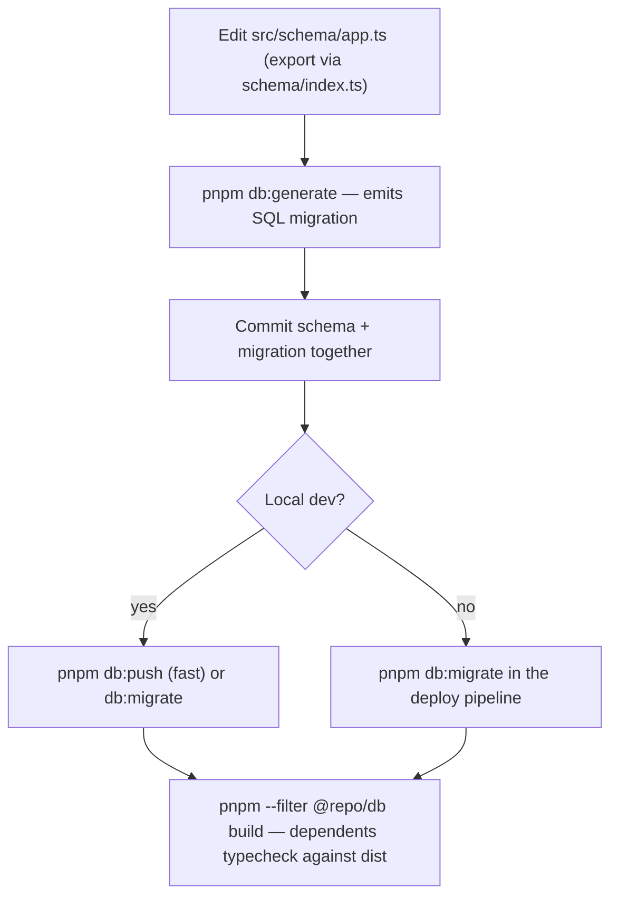

# packages/db — Database context

> Repo-wide paths and boundaries: root `backbone.yml` — read it before exploring with `find`/`grep`/`ls`.

Drizzle ORM (node-postgres) + drizzle-kit migrations. Postgres 17.

## Structure

- `src/id.ts` — `createId()`: the system-wide ULID generator
- `src/schema/auth.ts` — Better Auth tables; column set must match the plugins enabled in `packages/auth`
- `src/schema/app.ts` — application tables; add new tables here (copy the `post` pattern)
- `src/client.ts` — `createDb(connectionString)` → `Database` (lazy pg Pool)
- `drizzle/` — generated SQL migrations

## Workflow: change the schema

This package is consumed as built output — dependents see stale types until it rebuilds (turbo `^build` handles it in pipelines).

## Conventions

- Primary keys: `text('id').primaryKey().$defaultFn(() => createId())` — ULIDs, always.
- User ownership: `text('user_id').notNull().references(() => user.id, { onDelete: 'cascade' })` — orphaned rows leak data after account deletion.
- Timestamps: `timestamp('created_at').defaultNow().notNull()`; `updatedAt` with `$onUpdate(() => new Date())`.

## Boundaries

- Never hand-edit `drizzle/` — generated SQL; drizzle-kit tracks it in `meta/`, and manual edits desync the journal.
- Never use `uuid()`, `serial()`, or DB-side id defaults — ULIDs from `createId()` keep every key time-sortable and consistent with Better Auth records.
- Never import from `apps/*` — this package sits below both apps; an upward import is circular.
- If plugins change in `packages/auth`, regenerate auth tables with `npx @better-auth/cli@latest generate` and reconcile `src/schema/auth.ts` — drift breaks sign-in at runtime, not build time.
