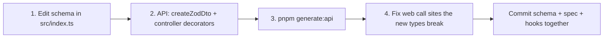

# packages/shared — API contracts (Zod)

> Repo-wide paths and boundaries: root `backbone.yml` — read it before exploring with `find`/`grep`/`ls`.

Single source of truth for every API request/response shape. Changes here fan out to backend validation, Swagger docs, and the generated frontend hooks.

## Workflow: change a contract

A schema change without step 3 leaves the frontend typed against a stale contract — CI fails on the drift.

## Conventions

- ID fields use `ulidSchema` (exported here) — all generated IDs in the system are ULIDs.
- Dates are `z.iso.datetime()` — schemas describe the JSON wire format. Never use `z.date()` or `z.coerce.date()` — `Date` cannot be represented in JSON Schema, so OpenAPI generation crashes.
- Request schemas stay strict and minimal (`.min/.max` limits); response schemas stay complete.
- Export both the schema and its inferred type: `export type X = z.infer<typeof xSchema>`.
